# Arquitetura — Criptotrade (visão completa deste repositório)

> Conjunto completo de **diagramas de arquitetura** de **todo este repositório**, no modelo **C4** (Contexto → Contêineres → Componentes) + vistas de apoio (dados/ERD, fluxo de dados, runtime, implantação, CI/CD, observabilidade, segurança) e **recomendações de arquitetura** com um estado-alvo proposto.
>
> Complementa `docs/uml/arquitetura-uml.md` (que detalha as **classes**). Aqui o foco é o **nível arquitetural**: sistemas, contêineres, integrações, dados, deploy e evolução.
>
> **Composição do repositório:** Python (backend, ~168 arq.), React/JSX (console em `docs/design/pages/`), 1 arquivo TypeScript gerado (`openapi.d.ts`, o contrato), infra (Docker/nginx/Prometheus/Grafana). Sem Rust.

## Índice
1. [C4 L1 — Contexto de Sistema](#1-c4-nível-1--contexto-de-sistema)
2. [C4 L2 — Contêineres](#2-c4-nível-2--contêineres)
3. [C4 L3 — Componentes: API](#3-c4-nível-3--componentes-do-contêiner-api)
4. [C4 L3 — Componentes: Loop Orquestrador](#4-c4-nível-3--componentes-do-contêiner-loop-orquestrador)
5. [Arquitetura de Dados (ERD + stores)](#5-arquitetura-de-dados)
6. [Fluxo de Dados (DFD)](#6-fluxo-de-dados-dfd)
7. [Vista de Runtime / Processos](#7-vista-de-runtime--processos)
8. [Implantação (3 topologias)](#8-implantação)
9. [Pipeline CI/CD](#9-pipeline-cicd)
10. [Arquitetura de Observabilidade](#10-arquitetura-de-observabilidade)
11. [Arquitetura de Segurança](#11-arquitetura-de-segurança)
12. [Recomendações e Arquitetura-Alvo](#12-recomendações-de-arquitetura-e-estado-alvo)

**Legenda de estereótipos (C4):** `«person»` ator humano · `«system»` sistema externo · `«container»` unidade executável/deployável (processo, app, banco) · `«component»` agrupamento lógico dentro de um contêiner. Setas = fluxo/dependência rotulada com protocolo.

---

## 1. C4 Nível 1 — Contexto de Sistema

**Objetivo:** o sistema Criptotrade como uma caixa preta, seus usuários e sistemas externos.

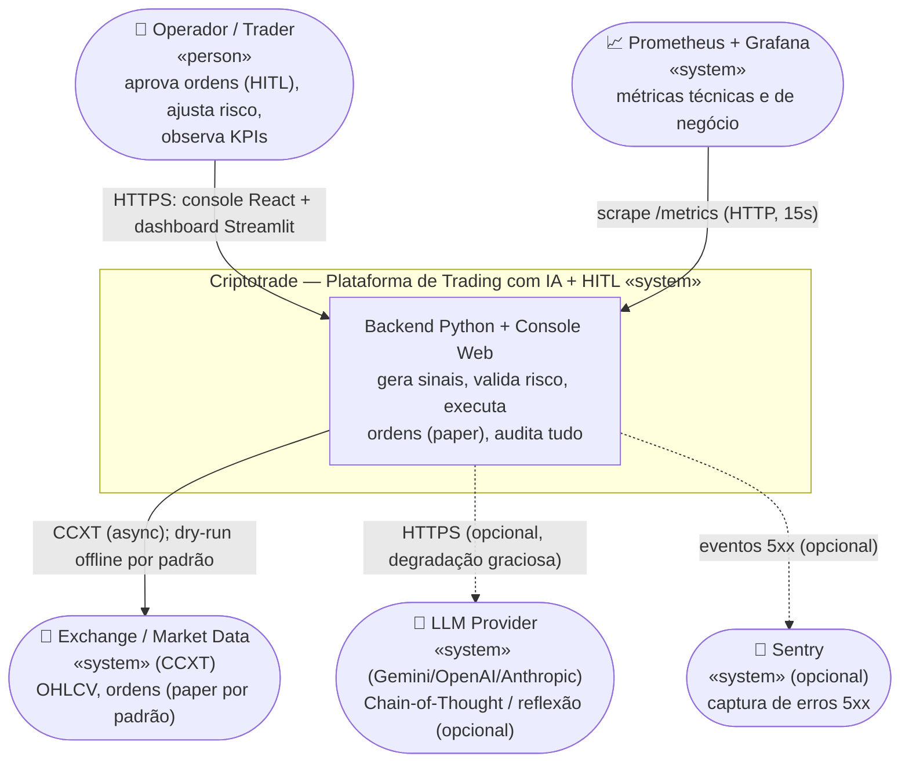

**Notas de arquitetura:**
- **HITL é primeira-classe:** o operador não é observador passivo — é parte do fluxo de execução (aprova/rejeita ordens acima do limiar de autonomia).
- **Fail-safe por padrão:** o único caminho para a exchange roda em `EXCHANGE_DRY_RUN=true` (mercado sintético offline); trading real exige override explícito no ambiente de deploy.
- **Dependências externas são todas opcionais/degradáveis:** LLM, Sentry e até a exchange (dry-run) podem faltar sem derrubar o núcleo.

---

## 2. C4 Nível 2 — Contêineres

**Objetivo:** as unidades executáveis/deployáveis e como se comunicam. Este é o diagrama de arquitetura central.

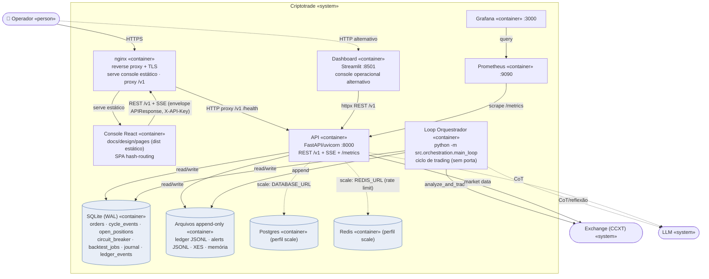

**Decisões arquiteturais-chave (o "porquê"):**

| Decisão | Racional | ADR |
|---|---|---|
| **API e Loop como contêineres separados** | Lifecycle independente: restart da API não para o trading, e vice-versa | ADR-002 |
| **Estado compartilhado via SQLite WAL** (sem RPC/fila) | Cross-process simples e durável; dois processos no mesmo host/volume | ADR-001/003 |
| **Paper trading first (`EXCHANGE_DRY_RUN`)** | Segurança: zero conexão real por padrão | ADR-001 |
| **Uma imagem Python para API/Loop/Dashboard** | Diferem só pelo `command`; simplifica build/deploy | — |
| **Console React estático (esbuild + nginx)** | Sem servidor Node em produção; SPA servida como arquivos | — |
| **Postgres/Redis opt-in (perfil `scale`)** | Escala horizontal sem mudar código (abstração de DB + rate limiter) | ADR-005 |

---

## 3. C4 Nível 3 — Componentes do Contêiner API

**Objetivo:** organização interna da FastAPI (`src/api/*`).

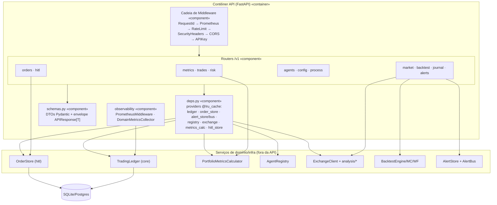

**Notas:**
- **Middleware em cadeia (fail-closed em prod):** `_enforce_prod_security()` recusa boot em produção sem `API_KEYS` + `CORS_ORIGINS` explícito. Rate limit por IP real (nginx repassa `X-Forwarded-*`).
- **Injeção via `deps.py`:** providers `@lru_cache(maxsize=1)` (singletons por processo), exceto `get_metrics_calculator` (fresco a cada request para refletir o ledger). `reset_singletons()` para testes.
- **Contrato tipado:** `schemas.py` → OpenAPI → `openapi.d.ts` (gate de drift no CI).

---

## 4. C4 Nível 3 — Componentes do Contêiner Loop Orquestrador

**Objetivo:** organização interna do processo de trading (`src/orchestration/*` + agentes).

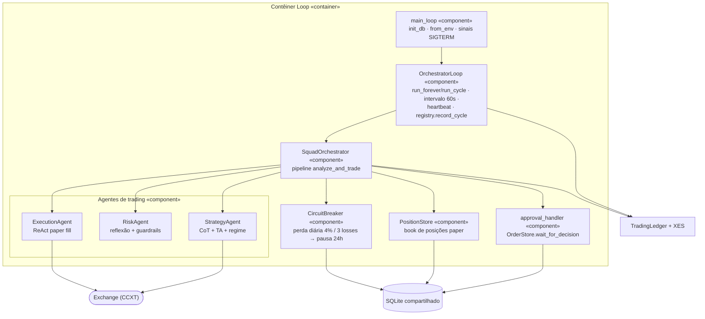

**Notas:**
- **Pipeline invariante:** `Strategy → (fecha SL/TP) → Risk → Guardrails → HITL → Execution → fill/ledger`, com circuit breaker no início. Fail-soft: falha de um símbolo emite `agent_cycle_failed` e o loop continua.
- **Recuperação de restart:** `reload_open_positions()` restaura book + breaker do SQLite (evita posições zumbi / streak esquecida).
- Detalhe de classes e sequência: ver `docs/uml/arquitetura-uml.md` §5.2 e §6.1.

---

## 5. Arquitetura de Dados

**Objetivo:** o modelo de persistência. O sistema usa **dois estilos**: (a) tabelas SQLite/Postgres para estado cross-process, (b) arquivos append-only (JSONL/JSON) para auditoria e memória.

### 5.1 ERD — estado relacional (SQLite WAL / Postgres)

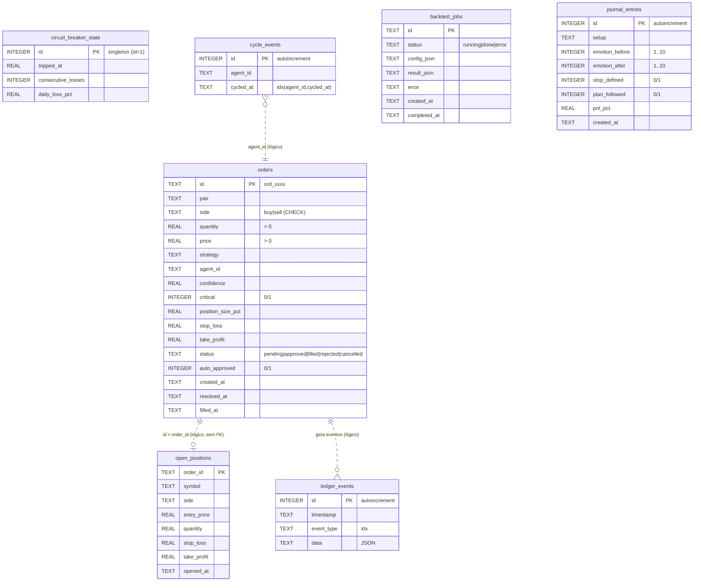

> **Nota de design importante:** as tabelas **não têm foreign keys** entre si. É deliberado — são datasets de coordenação cross-process (bridge HITL, contadores, book) desenhados para escrita concorrente por dois processos sem contenção de lock. As relações acima são **lógicas** (tracejadas). O `ledger_events` é o *event store* de onde métricas são derivadas.

### 5.2 Data stores completos (relacional + arquivos)

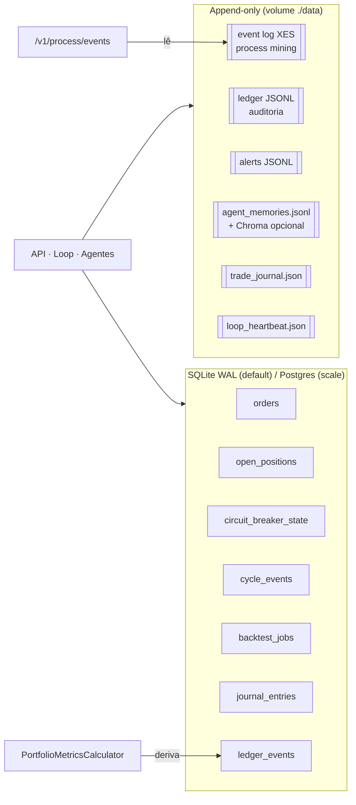

**Notas:**
- **Event Sourcing leve:** métricas de portfólio (Sharpe, win rate, drawdown, P&L) **não são armazenadas** — são recalculadas relendo `ledger_events` (`position_closed`, `order_fill`). Fonte única de verdade.
- **Migração de portabilidade:** `src/core/db.py` abstrai `connection()`; migrations em `migrations/` (+ `migrations/postgres/`) rodadas por `init_db()` (idempotente, ambos processos).
- **Dívida conhecida (ADR-003):** o XES/alerts ainda em JSONL; a migração completa para SQLite está deferida.

---

## 6. Fluxo de Dados (DFD)

**Objetivo:** como um sinal vira ordem, fill e métrica — o caminho do dado ponta a ponta.

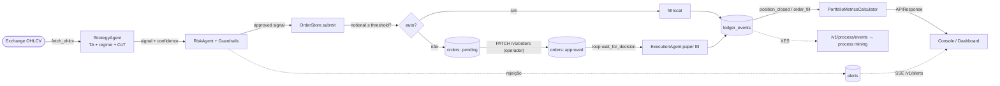

**Notas:** dois "portões" no fluxo — **guardrails** (risco por ordem) e **HITL** (aprovação por valor). Todo evento econômico passa pelo ledger, do qual métricas e process mining derivam.

---

## 7. Vista de Runtime / Processos

**Objetivo:** o que roda concorrentemente e como sincronizam.

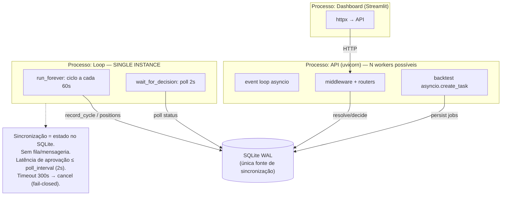

**Ponto de atenção arquitetural:** o **loop é single-instance por design** (ADR-005). O modelo HITL por *polling* de SQLite não é trivialmente replicável para N loops (precisaria de leader-election ou locks de linha). A API, sim, escala horizontalmente (estado externo + rate limiter Redis).

---

## 8. Implantação

**Objetivo:** as três topologias versionadas. Nós = contêineres; setas rotuladas com protocolo/porta.

### 8.1 Dev — `docker-compose.yml`

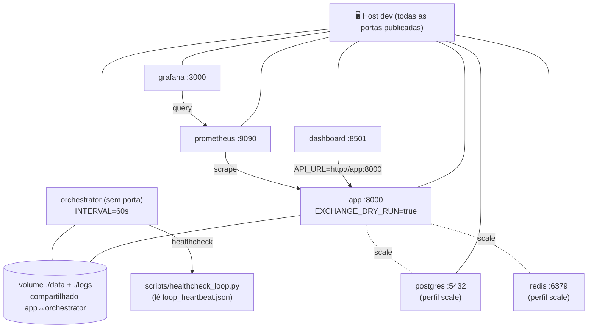

### 8.2 Prod self-contained — `docker-compose.prod.yml`

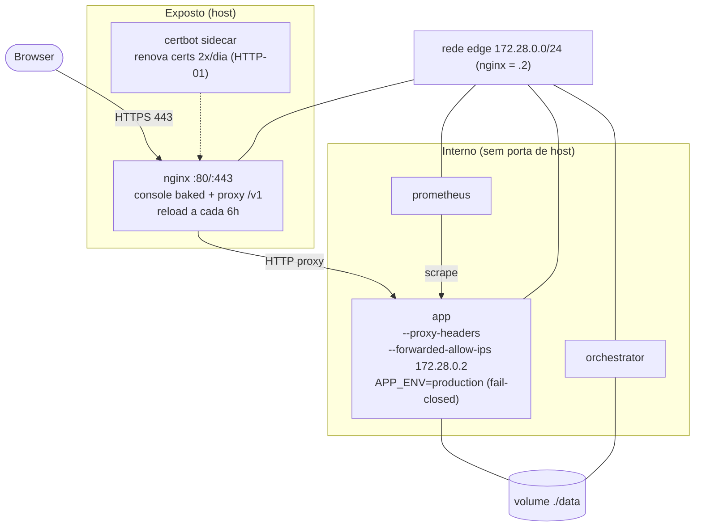

### 8.3 VPS atrás de gateway compartilhado — `docker-compose.vps.yml`

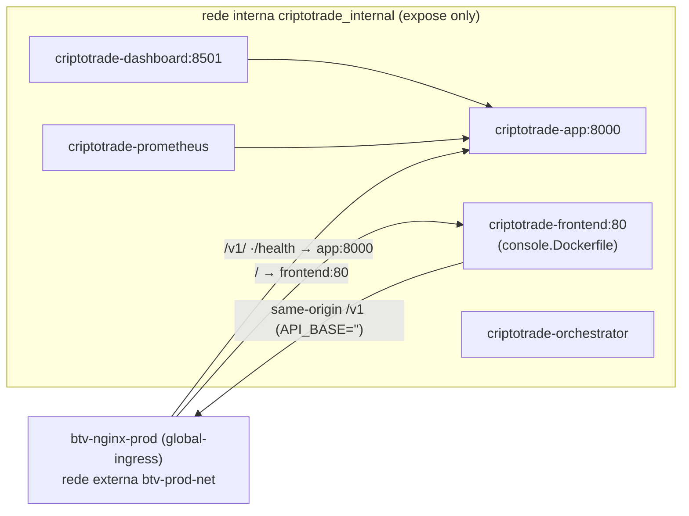

**Notas:**
- **Superfície pública mínima em prod:** só nginx/gateway publica 80/443; app/loop/prometheus ficam internos.
- **Confiança de proxy explícita:** app só aceita `X-Forwarded-*` de `172.28.0.2` → rate-limit por IP real.
- **Uma imagem Python** reusada; console em imagem nginx separada (`deploy/console.Dockerfile`, multi-stage node→nginx).

---

## 9. Pipeline CI/CD

**Objetivo:** os gates automáticos (GitHub Actions) que protegem `master`.

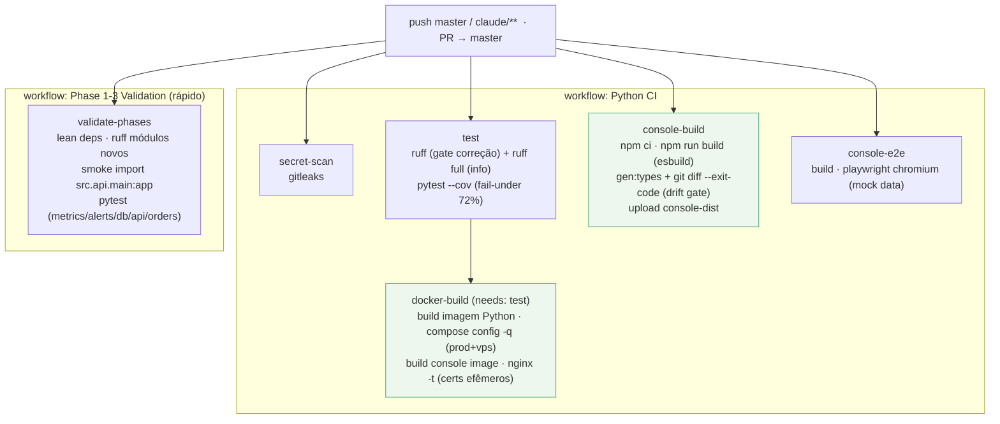

**Gates notáveis:**
- **Drift do contrato** (`gen:types` + `git diff --exit-code openapi.d.ts`): backend Python e front JS **não podem divergir**.
- **Compose/nginx validados no CI** com certs auto-assinados descartáveis.
- **Cobertura com piso** (`--cov-fail-under=72`, `pyproject.toml`), com meta de subir para 80%.
- **Dois workflows**: um completo (pesado) e um rápido por fases (deps enxutas).

---

## 10. Arquitetura de Observabilidade

**Objetivo:** os quatro pilares — métricas, logs, traces, e o diferencial de **process mining**.

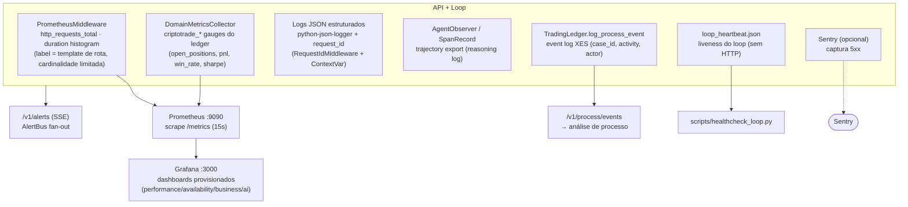

**Diferencial:** o **event log XES** (`log_process_event` emite `agent_cycle_started/completed/failed`, `order_submitted/approved/rejected/filled/cancelled`) habilita *process mining* real do fluxo de trading — raro em sistemas deste porte. Correlação por `request_id` liga logs a requests HTTP.

---

## 11. Arquitetura de Segurança

**Objetivo:** as camadas de defesa (rede, autenticação, risco, execução, segredos).

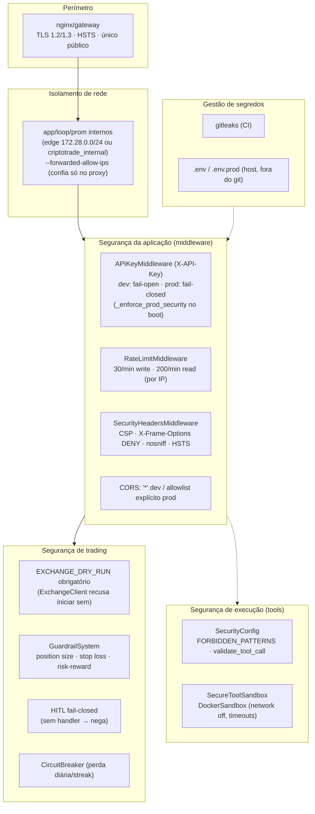

**Notas:**
- **Fail-closed onde importa:** produção recusa boot com auth aberto; HITL nega sem handler; exchange recusa sem `EXCHANGE_DRY_RUN`.
- **Defesa em profundidade:** perímetro (TLS) → rede (isolamento) → app (auth/rate/headers) → domínio (guardrails/HITL/breaker) → execução (sandbox).
- **Pontos a consolidar** (ver §12): duas políticas de validação de ordem (`GuardrailSystem` vs `SecurityConfig.validate_order`) e dois modelos de autonomia.

---

## 12. Recomendações de Arquitetura e Estado-Alvo

### 12.1 Achados priorizados

| # | Severidade | Achado | Recomendação |
|---|---|---|---|
| R1 | 🔴 Alta | **Cluster "BuildToValue" paralelo** (`UnifiedOrchestrator` + planning/routing/consensus/chains/parallel + agentes de engenharia) **não exercitado pelo trading** | Extrair para pacote opcional `src/experimental/` ou remover; medir cobertura real. Reduz superfície e confusão. |
| R2 | 🔴 Alta | **Colisões de nome** (`SquadOrchestrator`×2, `AdaptivePlanner`×2, `ContinuousEvaluator`×2, `MemoryStore`×2, `Guardrail`×2) | Renomear por propósito (ex.: `TradingSquad` vs `A2ASquad`). Evita imports errados. |
| R2b | 🟠 Média | **Duas fundações de agente** (`BaseAgent` async vs `SafeAgentBase` sync) sem ponte | Escolher uma base única ou documentar explicitamente os dois papéis. |
| R3 | 🟠 Média | **Duas políticas de validação de ordem** e **dois modelos de autonomia** (US$ threshold vs trust-score) | Eleger fonte única de política de risco/autonomia. |
| R4 | 🟠 Média | **HITL por polling de SQLite** acopla loop↔API ao arquivo; loop single-instance | Migrar coordenação para **Postgres `LISTEN/NOTIFY`** ou Redis pub/sub → menor latência + caminho para multi-loop. |
| R5 | 🟡 Baixa | **Kelly/proteções prontos mas não plugados** no sizing do pipeline | Ligar `PositionSizer`/`KellyCriterion`/`CapitalProtections` no `SquadOrchestrator._position_quantity`. |
| R6 | 🟡 Baixa | **Namespace `/v1/agents/...` servido por dois routers** (`agents` e `config`) | Consolidar num router único. |
| R7 | 🟡 Baixa | **XES/alerts ainda em JSONL** (ADR-003 deferido) | Concluir migração para SQLite/Postgres quando o volume justificar. |
| R8 | 🟡 Baixa | **Frontend "classic scripts" com globals `window.*`** | Migrar para ES modules + bundler quando o console crescer. |

### 12.2 Métricas qualitativas de acoplamento
- **Núcleo estável correto:** `core` é dependência de quase tudo e depende de pouco (config/db) — *Stable Dependencies Principle* respeitado.
- **God Object no cluster genérico:** `UnifiedOrchestrator` compõe 9 subsistemas — acoplamento eferente alto, reforça R1.
- **Bom uso de inversão de dependência:** callbacks (`alert_sink`, `state_db_provider`, `fill_callback`, `approval_handler`) quebram ciclos de import consistentemente.

### 12.3 Arquitetura-alvo proposta (evolução incremental)

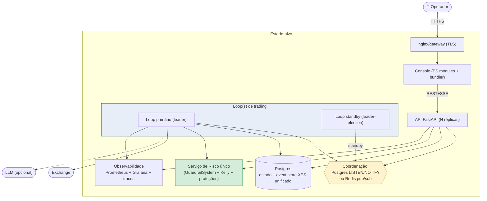

**Roteiro incremental (sem big-bang):**
1. **Higiene** (R1, R2): isolar/remover o cluster genérico e renomear colisões — baixo risco, alto ganho de clareza.
2. **Consolidação de política** (R3, R5, R6): uma fonte de risco/autonomia; plugar Kelly; unificar rotas de agentes.
3. **Coordenação** (R4, R7): trocar polling SQLite por `LISTEN/NOTIFY` no Postgres (já suportado pela abstração de DB) e unificar o event store — habilita multi-loop com leader-election.
4. **Frontend** (R8): migrar para ES modules/bundler.

Cada passo é independente e preserva o invariante central: **paper-trading-first, HITL fail-closed, tudo auditável no ledger/XES**.

---

> **Diagramas em Mermaid** (renderizam nativamente no GitHub). Nomes de contêineres/componentes/tabelas preservados conforme o código-fonte e migrations. Para detalhe de **classes** e sequências, ver `docs/uml/arquitetura-uml.md`.
