# Documentação UML — Criptotrade

> Análise arquitetural completa da plataforma **Criptotrade** (crypto AI trading com Human-in-the-Loop), gerada a partir da leitura recursiva de todos os arquivos-fonte do repositório.
>
> **Objetivo:** mapear como cada script/módulo/pacote se conecta ao todo — dependências, fluxos de dados e responsabilidades — como base para estudo de arquitetura e futuros refatoramentos.

---

## 0. Nota sobre o escopo multi-linguagem

O prompt original pedia análise de **Python + Rust + TypeScript**. A composição real do repositório, medida por varredura recursiva, é:

| Linguagem / tipo | Arquivos | Situação |
|---|---:|---|
| **Python** (`.py`) | 168 (~18,7k LOC) | **Núcleo do sistema** — backend, agentes, orquestração, API, análise, backtest |
| **React/JSX** (`.jsx`, `.js`, `.mjs`) | ~24 | Console operacional em `docs/design/pages/` (React "classic scripts" + build esbuild) |
| **TypeScript** (`.d.ts`) | 1 | `docs/design/pages/openapi.d.ts` — **contrato gerado** a partir do OpenAPI da FastAPI |
| **Rust** (`.rs`) | 0 | **Ausente** — não há código Rust no repositório |
| SQL / YAML / Dockerfile / conf | ~30 | Migrations, config, infra |

**Decisões de adaptação:**

- **Rust:** a seção específica é omitida por inexistência de código Rust. A metodologia de ownership/traits não se aplica.
- **TypeScript:** existe um único arquivo `.d.ts`, que **não é código de aplicação** e sim o **contrato transversal** gerado (`openapi-typescript` a partir do `openapi.json` emitido pela FastAPI). Ele é tratado na seção de *entidades transversais* (§ 4 e § 5.8), por ser exatamente o elo tipado entre backend Python e frontend JS.
- **Frontend:** o console React (JSX) é o equivalente prático da camada "TypeScript/front-end" da metodologia — é analisado como componente e pacote.

O restante deste documento segue a metodologia pedida (mapeamento estrutural → análise estática → padrões → diagramas), aplicada à realidade Python-cêntrica do projeto.

---

## 1. Mapeamento Estrutural (Top-down)

### 1.1 Mapa de diretórios e responsabilidades

```
Criptotrade/
├── src/                         # ── BACKEND (Python) ──────────────────────
│   ├── agents/                  # Agentes de IA (BaseAgent + especialistas)
│   ├── orchestration/           # Loop contínuo + SquadOrchestrator (pipeline de trading)
│   ├── strategies/              # Estratégias de trading (Strategy pattern)
│   ├── analysis/                # Indicadores, S/R, volume, regime, padrões
│   ├── backtest/                # Engine, Monte Carlo, walk-forward
│   ├── evaluation/              # Avaliação contínua, A/B testing
│   ├── consensus/               # Votação ponderada entre agentes
│   ├── routing/                 # Roteamento adaptativo (learning router)
│   ├── planning/                # Planejamento hierárquico/adaptativo
│   ├── chains/ · parallel/      # Cadeias resilientes · execução paralela
│   ├── risk/                    # Kelly, sizing, proteções de capital
│   ├── safety/                  # GuardrailSystem, SecurityConfig
│   ├── hitl/                    # Human-in-the-Loop (OrderStore, níveis de autonomia)
│   ├── core/                    # Infra: config, db, ledger, métricas, exchange, alerts, llm
│   ├── memory/                  # Memória de agentes (JSONL + Chroma opcional)
│   ├── journal/                 # Diário de trades (psicologia/plano)
│   ├── tools/                   # MCP registry, RAG, sandbox seguro
│   ├── protocols/              # MCP server, squad (variante A2A)
│   ├── api/                     # FastAPI gateway /v1 (routes, schemas, deps, middleware)
│   ├── dashboard/               # Console Streamlit (consumidor da API)
│   └── utils/                   # Observabilidade, memória utilitária
├── docs/design/pages/           # ── FRONTEND (React/JSX) + openapi.d.ts (TS) ──
├── migrations/                  # DDL SQLite/Postgres
├── config/ · monitoring/        # YAML de risco/prompts · Prometheus/Grafana
├── deploy/ · docker-compose*.yml# nginx, Dockerfiles, topologias dev/prod/vps
└── tests/                       # unit · integration · api · hitl · emergent
```

### 1.2 Fronteiras de sistema e mecanismos de comunicação

O sistema roda em **dois processos que não compartilham lifecycle** (um restart da API não para o trading), comunicando-se por **estado compartilhado em SQLite (WAL)** + volume de arquivos append-only:

```
Browser / Operador
   │ HTTPS (REST + SSE)
   ▼
[nginx]  ──proxy HTTP──►  [API FastAPI :8000]  ◄──HTTP── [Dashboard Streamlit :8501]
                              │  escreve/lê                     (consumidor puro da API)
                              ▼
                  ┌───────────────────────────┐
                  │  SQLite WAL (orders,       │◄── shared state (cross-process)
                  │  cycle_events, ledger_...) │
                  │  + JSONL (ledger, alerts)  │
                  └───────────────────────────┘
                              ▲
                              │  escreve/lê (mesmo volume ./data)
                  [Orchestrator loop process] ── python -m src.orchestration.main_loop
                              │
                              └─► ExchangeClient (dry-run/paper por padrão)
```

| Fronteira | Mecanismo | Detalhe |
|---|---|---|
| Browser ↔ nginx | **HTTPS** | TLS 1.2/1.3, HSTS |
| Console/Dashboard ↔ API | **REST `/v1` + SSE** | envelope `APIResponse<T>`, header `X-API-Key`, SSE em `/v1/alerts` |
| API ↔ Loop | **SQLite WAL** (sem RPC) | HITL bridge: API *decide* (`approved`/`rejected`), loop *executa* (`wait_for_decision` → `mark_filled`) |
| Backend ↔ Exchange | **CCXT** (async) | por padrão `EXCHANGE_DRY_RUN=true` → mercado sintético offline |
| Backend ↔ LLM | **LangChain** (opcional) | Gemini/OpenAI/Anthropic; ausência de chave = desabilitado (fail-safe) |
| Backend Python ↔ Frontend JS | **`openapi.d.ts`** (contrato) | gerado do OpenAPI; drift barrado no CI (`git diff --exit-code`) |
| Métricas | **Prometheus scrape** | `/metrics`; Grafana provisionado |

### 1.3 Dependências externas por linguagem

**Python (`requirements.txt`):**
- Núcleo: `pydantic`, `pydantic-settings`, `PyYAML`, `python-dotenv`
- API/Web: `fastapi`, `uvicorn`, `streamlit`, `httpx`, `sse-starlette`, `slowapi`
- IA/Agentes: `langchain`, `langchain-core`, `langchain-google-genai` (Chroma opcional)
- Trading/dados: `ccxt`, `pandas`, `numpy`, `ta`
- Persistência: `sqlalchemy`, `psycopg[binary]` (Postgres opcional)
- Observabilidade: `prometheus-client`, `python-json-logger`, `sentry-sdk[fastapi]`
- Segurança: `cryptography`, `slowapi`; async: `aiohttp`

**Frontend (`docs/design/pages/package.json`):**
- Runtime: `react` / `react-dom` 18.3.1 (UMD globals, sem bundler em dev)
- Build/test: `esbuild`, `openapi-typescript`, `@playwright/test`, `typescript`

---

## 2. Diagrama de Casos de Uso

**Objetivo:** identificar atores e as funcionalidades principais visíveis nas fronteiras do sistema (API `/v1` + dashboard + loop).

**Escopo:** operação do sistema pelo operador humano (HITL), automação do loop de trading, e integrações externas (exchange, LLM, monitoramento).

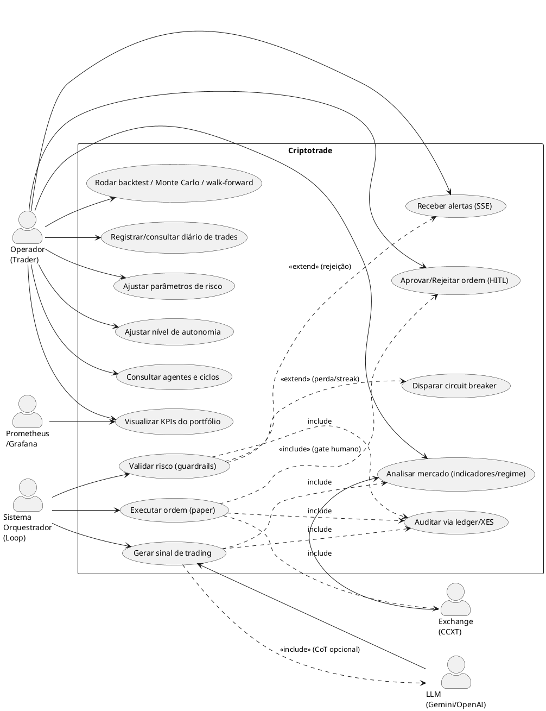

**Legenda:** `«include»` = comportamento sempre executado como parte do caso base; `«extend»` = comportamento condicional; atores à esquerda (humano/sistemas) disparam os casos.

**Notas de design:**
- O **gate HITL** é obrigatório na execução (`«include»`), mas o modo *auto-approval* (Model B) fila-e-preenche ordens abaixo do limiar de valor sem intervenção — o operador só é chamado acima do threshold.
- O **circuit breaker** é uma extensão do fluxo de validação/resultado: dispara com perda diária ≥ 4% ou 3 perdas consecutivas.
- O **LLM é opcional**: Chain-of-Thought no `StrategyAgent` e reflexão no `RiskAgent` degradam graciosamente para o score determinístico quando não há chave de API.

---

## 3. Diagrama de Pacotes

**Objetivo:** organização lógica do código Python e dependências direcionadas entre pacotes.

**Escopo:** todos os subpacotes de `src/` + frontend + contrato.

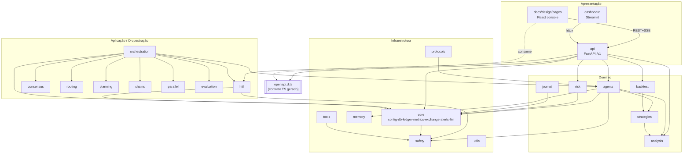

**Legenda:** seta cheia = dependência de import/uso; seta tracejada = consumo do contrato; caixa `[[...]]` = artefato gerado. Camadas de cima (apresentação) dependem das de baixo (infra), não o contrário.

**Notas de design:**
- **Direção de dependência saudável no eixo principal:** apresentação → aplicação → domínio → infra. `core` é o núcleo estável do qual quase tudo depende (config, db, ledger).
- **Dois "clusters" de orquestração convivem** (ver § 5.2): o cluster de **trading** (`orchestration.squad_orchestrator` + `agents.{strategy,risk,execution}`) e o cluster **genérico "BuildToValue"** (`orchestration.unified_orchestrator` + `planning/routing/consensus/chains/parallel` + agentes de engenharia). O segundo **não está no caminho de trading** — é acoplamento potencialmente removível.
- **Acoplamento fraco via callbacks:** `safety.guardrails` não importa `core.alerts`; recebe um `alert_sink: Callable[[str], None]`. Boa inversão de dependência.

---

## 4. Diagrama de Componentes

**Objetivo:** componentes de runtime (processos/serviços) e interfaces de comunicação.

**Escopo:** deploy lógico — API, loop, dashboard, console, persistência, atores externos.

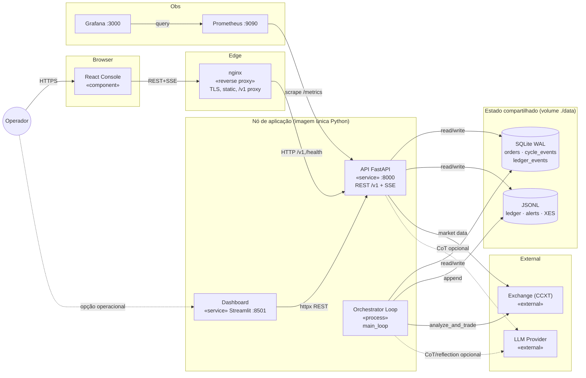

**Legenda:** `«service»` = processo servido em porta; `«process»` = processo sem porta; `«external»` = dependência fora do deploy; cilindro = repositório de dados; seta tracejada = dependência opcional.

**Notas de design:**
- **Uma única imagem Python** serve API, loop e dashboard (diferem só pelo `command`). Simplifica build; separa lifecycle por processo.
- **Ponto de integração crítico (e frágil):** a coordenação API↔loop é feita **exclusivamente via polling do SQLite** (`wait_for_decision`, `poll_interval=2s`). Não há fila/mensageria — é simples e cross-process, mas o loop só percebe uma aprovação com latência de até `poll_interval`, e um timeout de 300s auto-cancela (fail-closed).
- **Console é 100% estático** (React "classic scripts" transpilado por esbuild, servido por nginx). Não há servidor Node em produção.

---

## 5. Diagramas de Classes (por camada)

> Dado o volume (>150 classes), o diagrama de classes é **quebrado por camada** com referência cruzada, conforme o critério de clareza da metodologia.

### Legenda comum (todas as subseções)

| Notação | Significado |
|---|---|
| `<|--` | herança / implementação |
| `*--` | composição (dono cria/possui) |
| `o--` | agregação (referência injetada) |
| `-->` | associação / uso |
| `..>` | dependência pontual (import lazy, factory) |
| `«abstract»` `«dataclass»` `«enum»` `«protocol»` `«service»` `«repository»` `«dto»` `«factory»` | estereótipos |

---

### 5.1 Camada de Agentes

**Objetivo:** hierarquia dos agentes e suas dependências para o domínio de análise/risco/execução.
**Escopo:** `src/agents/*` + `src/core/safe_agent_base.py`.

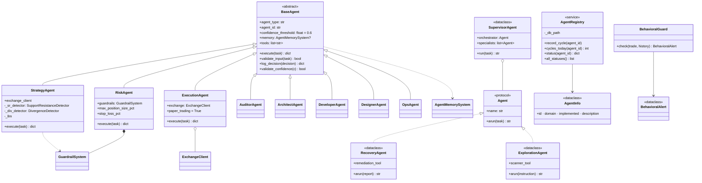

**Notas de design:**
- **Padrão Template Method + async:** `BaseAgent.execute` é `@abstractmethod async`; cada especialista implementa seu raciocínio (CoT no Strategy, Reflection no Risk, ReAct no Execution).
- **Duas hierarquias de "agente base" desconectadas:** `BaseAgent` (ABC, `execute` async, em `src/agents/`) e `SafeAgentBase` (em `src/core/`, `execute` **síncrono**, composição de guardrails — ver § 5.6). **Nenhum arquivo faz a ponte** — é um sintoma de duas fundações concebidas em momentos diferentes; candidato a unificação.
- **Registry não é factory:** `AgentRegistry` só reporta metadados/status/ciclos (cross-process via `cycle_events`); não instancia agentes. Apenas `strategy`/`risk`/`execution` são `implemented=True`; `recovery`/`exploration` são stubs (`implemented=False` → API retorna 501). Os agentes de engenharia (architect/auditor/…) são subclasses de `BaseAgent` **não registradas** no domínio de trading.
- **Protocolo estrutural:** `SupervisorAgent` depende do `Agent` Protocol; `Recovery/Exploration` o satisfazem (duck typing), embora ainda não estejam ligados ao trading.

---

### 5.2 Camada de Orquestração e Pipeline de Trading

**Objetivo:** o coração do sistema — como o loop dirige o `SquadOrchestrator` e como este encadeia os agentes.
**Escopo:** `src/orchestration/*`.

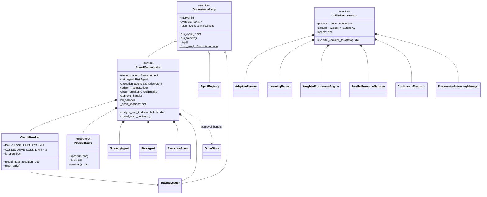

**Notas de design:**
- **Pipeline central (`SquadOrchestrator.analyze_and_trade`):** `Strategy → (checagem de posições SL/TP) → Risk → Guardrails → HITL → Execution → fill/ledger`, com circuit breaker no início. Tudo `async`; helpers de sizing/PnL são síncronos. Ver sequência em § 6.1.
- **Recuperação de restart:** `reload_open_positions()` restaura o *position book* e o estado do breaker do SQLite (evita "posições zumbi").
- **Dois orquestradores + colisões de nome** — 🟢 **colisões resolvidas (Onda 2, R2):** as duplicatas mortas foram renomeadas por propósito:
  - `SquadOrchestrator` (trading real, `orchestration/`) permanece; a variante A2A em `protocols/` virou **`A2ASquad`**.
  - `AdaptivePlanner` (`planning/adaptive_planner.py`) permanece; o duplicado virou **`AdaptiveReplanner`** (`adaptive_replanner.py`).
  - `ContinuousEvaluator` (`continuous_eval.py`, plain) permanece; o dataclass virou **`AgentPerformanceEvaluator`** (`continuous_evaluator.py`).
  - O `UnifiedOrchestrator` e todo o cluster planning/routing/consensus **não são exercitados pelo trading** — é infraestrutura genérica "BuildToValue" paralela. Alto risco de código morto/confusão.

---

### 5.3 Camada de Estratégias e Análise

**Objetivo:** o Strategy pattern e os DTOs de análise técnica que alimentam as estratégias.
**Escopo:** `src/strategies/*`, `src/analysis/*`.

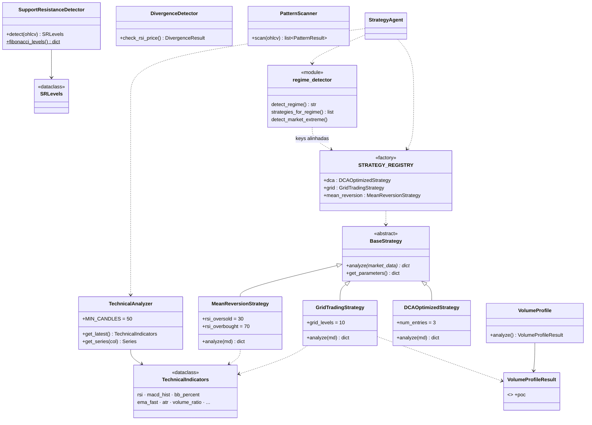

**Notas de design:**
- **Strategy pattern completo:** `BaseStrategy` (ABC) ← 3 concretas, selecionadas via `STRATEGY_REGISTRY` (registro plugin, com import condicional). O `StrategyAgent` escolhe a estratégia pelo **regime de mercado detectado** (`regime_detector.strategies_for_regime`). 🟢 **Desde Onda 1** as chaves realmente espelham o registry — `mean_reversion` (antes registrada mas nunca emitida) agora é roteada no regime `sideways`.
- **DTO central:** `TechnicalIndicators` (`@dataclass`, ~20 campos) é produzido por `TechnicalAnalyzer` e consumido polimorficamente pelas estratégias via `market_data["indicators"]`. Bom desacoplamento por dados.
- **Consumo duck-typed:** `BacktestEngine` (§ 5.4) também chama `strategy.analyze(...)`, tratando qualquer `BaseStrategy` como *context* — reuso limpo entre trading e backtest. 🟢 **Desde Onda 2** o backtest constrói o mesmo `TechnicalIndicators` real (não placeholders), então estratégias dirigidas por indicadores exercitam o mesmo caminho.
- **`regime_detector` é módulo de funções** (sem classe) — ponte funcional entre análise e o factory de estratégias.

---

### 5.4 Camada de Backtest e Avaliação

**Objetivo:** validação de estratégias fora do caminho de produção.
**Escopo:** `src/backtest/*`, `src/evaluation/*`.

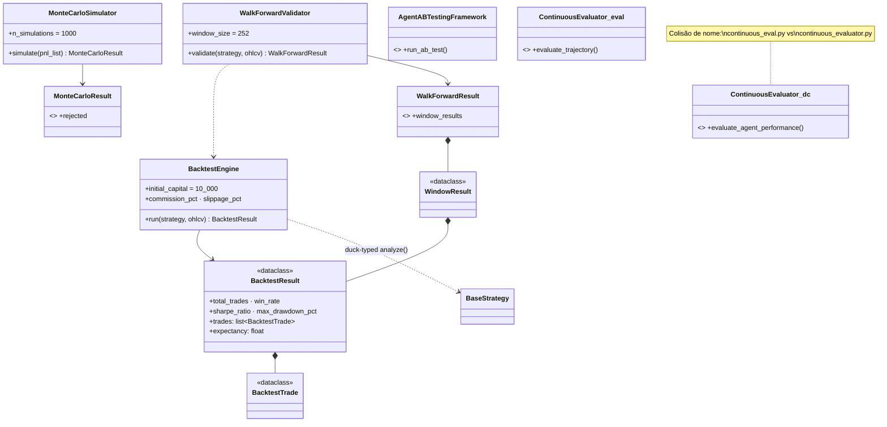

**Notas de design:**
- **Composição em árvore de resultados:** `WalkForwardResult ◆ WindowResult ◆ BacktestResult ◆ BacktestTrade` — DTOs imutáveis, fáceis de serializar para a API (`/v1/backtest/*`).
- **Validação anti-overfitting:** o `WalkForwardValidator` (`MAX_SHARPE_DEVIATION=0.30`) e o `MonteCarloSimulator` (percentis 5/95, `rejected`) formam um filtro de robustez estatística antes de promover uma estratégia.
- **`ContinuousEvaluator` duplicado:** 🟢 **resolvido (Onda 2, R2)** — a versão dataclass usada pelo `UnifiedOrchestrator` foi renomeada para `AgentPerformanceEvaluator`; a plain (`continuous_eval.py`) mantém o nome.

---

### 5.5 Camada Core — Persistência, Métricas e Integrações

**Objetivo:** a "espinha dorsal" de infraestrutura (ledger append-only, abstração de DB, métricas, exchange, alertas, LLM).
**Escopo:** `src/core/*`.

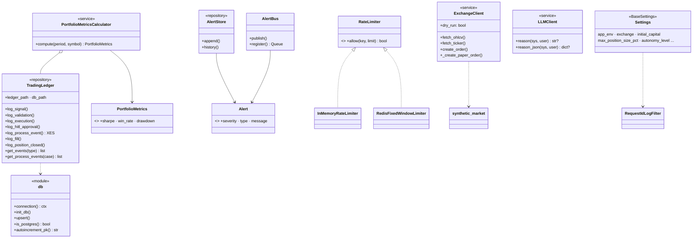

**Notas de design:**
- **Ledger como *event store* (Event Sourcing leve):** `TradingLedger` grava eventos append-only em SQLite (`ledger_events`) e emite um **event log XES** (`log_process_event`) para *process mining* (`/v1/process/events`). O `PortfolioMetricsCalculator` **deriva** todas as métricas relendo esses eventos (`position_closed`, `order_fill`) — fonte única de verdade, sem estado mutável duplicado.
- **Abstração de DB portável:** `db.connection()` é o único ponto de acesso; `_PgConn`/`_Row` adaptam Postgres à API do `sqlite3`. Migrations são backend-aware (`migrations/` + `migrations/postgres/`). Permite escalar de SQLite (default) a Postgres (ADR-005) sem tocar nos repositórios.
- **Fail-safe por design:** `ExchangeClient` exige `EXCHANGE_DRY_RUN` (recusa iniciar sem) e, em dry-run, usa `synthetic_market` offline. `LLMClient` retorna `None` sem chave. `RedisFixedWindowLimiter` faz *fail-open* para memória.
- **Pub/Sub para SSE:** `AlertBus` faz fan-out in-process para `asyncio.Queue` (assinantes do `/v1/alerts`); `AlertStore` persiste em JSONL. `make_guardrail_sink` conecta guardrails → alertas por callback (sem import cruzado).

---

### 5.6 Camada de Risco e Segurança

**Objetivo:** as regras que protegem capital e execução.
**Escopo:** `src/risk/*`, `src/safety/*`, `src/core/safe_agent_base.py`.

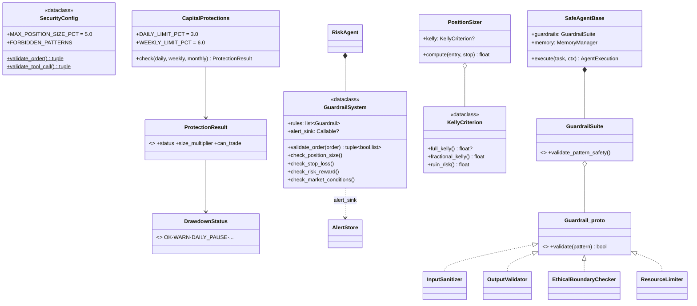

**Notas de design:**
- **Dois conceitos de "guardrail" coexistem** (colisão semântica a esclarecer): (1) `safety.guardrails.GuardrailSystem` — regras de **risco de trading** por ordem (position size, stop, risk-reward), usado pelo `RiskAgent` e pelo `OrderStore`; (2) `core.safe_agent_base` — **guardrails de segurança de execução** (sanitização, ética, limites de recurso) sobre o `SafeAgentBase` (que não é usado no trading). Nomes iguais, propósitos distintos.
- **Duas validações de ordem redundantes:** `GuardrailSystem.validate_order` (instância, com regras dinâmicas + alertas) e `SecurityConfig.validate_order` (classmethod estático). Convém eleger uma única fonte de política.
- **Sizing avançado disponível, mas subutilizado:** 🟡 **parcial (Onda 2, ADR-006)** — a fórmula central do Kelly virou fonte única (`src/risk.full_kelly_fraction`), consumida pelo endpoint `/v1/risk/kelly` (não reimplementa mais inline). **Resta:** o `SquadOrchestrator` ainda dimensiona por `position_size_pct` simples — plugar `KellyCriterion`/`PositionSizer`/`CapitalProtections` no sizing é a cauda do R5.

---

### 5.7 Camada HITL, DTOs da API e Contrato

**Objetivo:** o gate humano cross-process e o contrato de dados da API.
**Escopo:** `src/hitl/*`, `src/api/schemas.py`, `openapi.d.ts`.

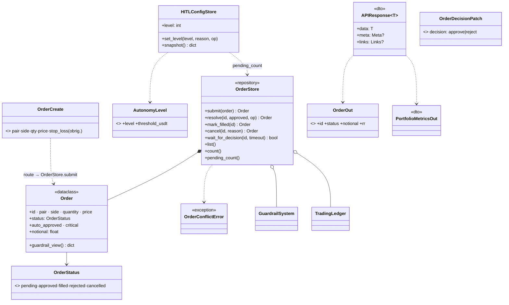

**Máquina de estados do `Order` (HITL):**

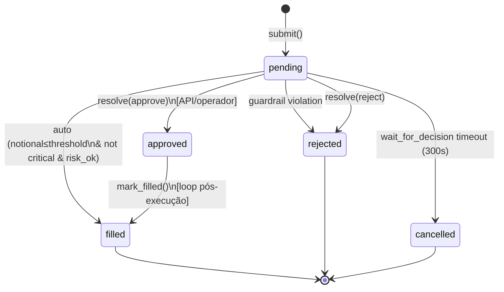

**Notas de design:**
- **Contrato tipado ponta-a-ponta:** os DTOs Pydantic em `schemas.py` são embrulhados no envelope genérico `APIResponse[T]` (`data`/`meta`/`_links`, HATEOAS). O `openapi-typescript` gera `openapi.d.ts` a partir do OpenAPI; o CI roda `gen:types` + `git diff --exit-code` — **impossível o backend Python e o front JS divergirem** sem quebrar o build. Essa é a *entidade transversal* que a metodologia pedia.
- **Validações de negócio no schema:** `OrderCreate` exige `stop_loss` (>0) e `reason` (≥10 chars); `OrderDecisionPatch` exige `operator_note` ao rejeitar. Regras de risco codificadas já na fronteira.
- **Modelo dois-processos explícito:** a **API decide** (`resolve` grava `approved`/`rejected`), o **loop executa** (`wait_for_decision` vê `approved` → roda `ExecutionAgent` → `mark_filled`). `mark_filled` é atômico e idempotente (`WHERE status='approved'`) — sem duplo-preenchimento.
- **Ponto de atenção (namespace):** `PATCH /v1/agents/{id}/config` (router `config`) coexiste com `GET /v1/agents/{id}/config` e `GET /v1/agents/{id}` (router `agents`) — mesma raiz `/v1/agents` servida por dois módulos. Além disso, há dois modelos de autonomia (`hitl.config` por valor US$ vs `hitl.progressive_autonomy` por trust-score) — só o primeiro está ligado às rotas.

---

### 5.8 Camada de Apresentação (Frontend React)

**Objetivo:** estrutura de componentes do console e o único ponto de I/O com o backend.
**Escopo:** `docs/design/pages/*`.

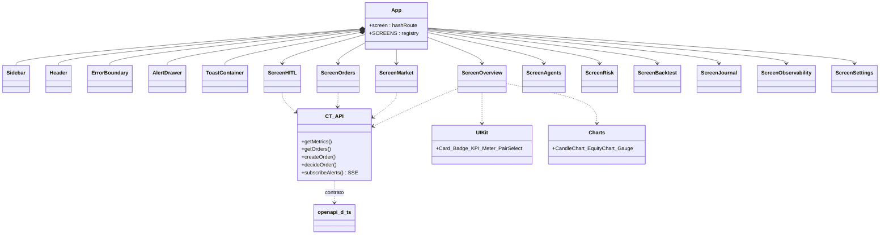

**Notas de design:**
- **Arquitetura "classic scripts":** React/ReactDOM como UMD globals; cada arquivo compartilha o escopo global e publica símbolos em `window.*` (`window.Badge`, `window.CT_API`). Sem sistema de módulos em dev; o `build.mjs` (esbuild, `bundle:false`) transpila cada `.jsx` isoladamente em IIFE e auto-hospeda o React de produção. Simples, mas frágil quanto a ordem de carga e colisões globais — candidato natural a migrar para ES modules/bundler se o console crescer.
- **`CT_API` é o único ponto de I/O:** `fetch` REST + `EventSource` (SSE) em `/v1/alerts`; desembrulha `j.data ?? j` (o envelope `APIResponse`); reescreve `BTC/USDT`→`BTC-USDT` nas rotas de mercado. Cada `Screen` possui suas chamadas — bom isolamento por tela.
- **Roteamento por hash** (`#overview`, `#market`…) → SPA fallback no nginx (`try_files … /index.html`). E2E Playwright roda sobre mock (`USE_MOCK_DATA`), sem backend.

---

## 6. Diagramas de Sequência

### 6.1 Ciclo de trading contínuo (fluxo de negócio principal)

**Objetivo:** ordem temporal exata do pipeline `analyze_and_trade` dentro de um ciclo do loop.
**Escopo:** loop → squad → agentes → guardrails → HITL → execução → ledger.

```mermaid
sequenceDiagram
    autonumber
    participant Loop as OrchestratorLoop
    participant Squad as SquadOrchestrator
    participant CB as CircuitBreaker
    participant SA as StrategyAgent
    participant EX as ExchangeClient
    participant RA as RiskAgent
    participant GS as GuardrailSystem
    participant HITL as approval_handler<br/>(OrderStore)
    participant EA as ExecutionAgent
    participant L as TradingLedger

    Loop->>L: log_process_event(agent_cycle_started)
    Loop->>Squad: await analyze_and_trade(symbol)
    Squad->>CB: is_open?
    alt breaker aberto
        CB-->>Squad: true
        Squad-->>Loop: {success:false, "trading paused"}
    else breaker fechado
        Squad->>SA: await execute({symbol, timeframe})
        SA->>EX: await fetch_ohlcv(symbol)
        EX-->>SA: OHLCV (ou stub sintético)
        SA->>SA: TA + regime + confidence (CoT LLM opcional)
        SA-->>Squad: {signal, confidence, stub_used}
        Squad->>Squad: _check_open_positions() (fecha SL/TP)
        Squad->>L: log_signal()
        alt confidence < 0.6
            Squad-->>Loop: {success:false, "low confidence"}
        else
            Squad->>RA: await execute({signal, portfolio})
            RA->>GS: validate_order(signal)
            GS-->>RA: (approved, issues)
            RA-->>Squad: {approved, validation}
            Squad->>L: log_validation()
            alt rejeitado
                Squad->>L: log + emit_alert()
                Squad-->>Loop: {success:false, "risk failed"}
            else aprovado
                Squad->>HITL: await approval_handler(signal)
                Note over HITL: submete Order; auto-fill se ≤ threshold,<br/>senão wait_for_decision (cross-process)
                HITL-->>Squad: order_id | None
                Squad->>L: log_hitl_approval()
                alt humano aprovou
                    Squad->>EA: await execute({signal, quantity})
                    EA->>EX: await create_order() (paper)
                    EX-->>EA: fill (preço+fee)
                    EA-->>Squad: {success, order_id, executed_price}
                    Squad->>L: log_execution() + log_fill()
                    Squad->>HITL: fill_callback(order_id) → mark_filled
                else rejeitado
                    Squad-->>Loop: {success:false}
                end
            end
        end
    end
    Loop->>L: log_process_event(agent_cycle_completed) + heartbeat
```

**Notas:** todos os pontos `await` estão em `run_cycle`/`analyze_and_trade`/agentes; falha de um símbolo é *fail-soft* (o loop emite `agent_cycle_failed` e segue). A ordem `Strategy → posições → Risk → HITL → Execution` é invariante.

### 6.2 Aprovação HITL cross-process (API decide, loop executa)

**Objetivo:** mostrar a coordenação dos dois processos via SQLite compartilhado.

```mermaid
sequenceDiagram
    autonumber
    actor Op as Operador (Console/Dashboard)
    participant API as API FastAPI
    participant DB as SQLite (orders)
    participant Store as OrderStore
    participant Loop as OrchestratorLoop

    Loop->>Store: submit(Order) [notional > threshold]
    Store->>DB: INSERT status='pending'
    Store->>Loop: wait_for_decision(id) inicia polling
    loop a cada poll_interval (2s)
        Loop->>DB: SELECT status WHERE id=?
        DB-->>Loop: 'pending'
    end
    Op->>API: PATCH /v1/orders/{id}/status {approve}
    API->>Store: resolve(id, approved=true)
    Store->>DB: UPDATE status='approved'
    Note over Loop,DB: próximo poll vê 'approved'
    Loop->>DB: SELECT status
    DB-->>Loop: 'approved'
    Store-->>Loop: True
    Loop->>Loop: ExecutionAgent.execute() (paper fill)
    Loop->>Store: mark_filled(id)
    Store->>DB: UPDATE status='filled' WHERE status='approved'
    Note over Op,DB: timeout de 300s sem decisão → cancel() (fail-closed)
```

**Notas de design:** não há mensageria — o acoplamento é o **estado no SQLite (WAL)**. Latência de aprovação ≤ `poll_interval`. Idempotência garantida pelo `WHERE status='approved'`.

### 6.3 Backtest assíncrono (job)

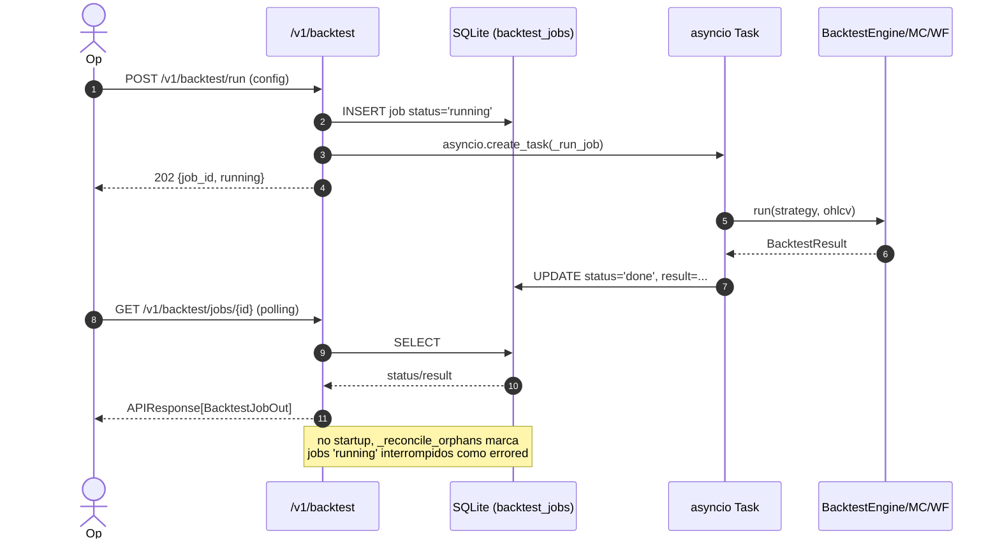

---

## 7. Diagramas de Atividades

### 7.1 Geração de sinal + blend de confiança (StrategyAgent)

**Objetivo:** o workflow com múltiplos caminhos de decisão dentro de `StrategyAgent.execute`.

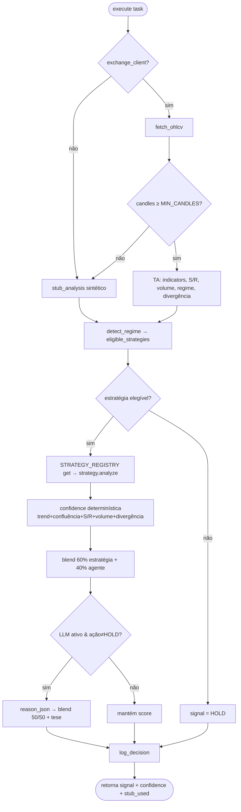

### 7.2 Decisão de execução com circuit breaker e proteções (visão de negócio)

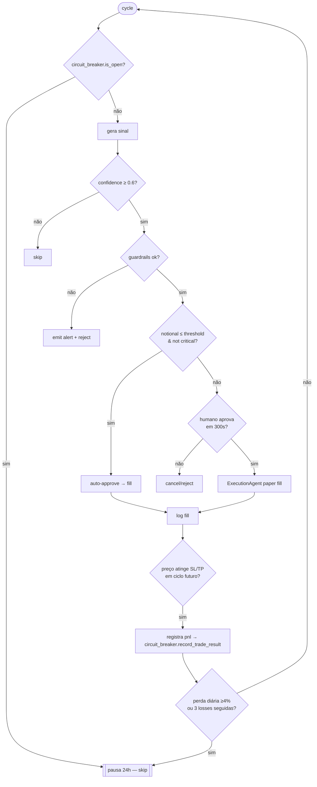

**Notas de design:** há **paralelismo real** apenas no `UnifiedOrchestrator` (`ParallelResourceManager` com `asyncio.Semaphore` + `gather`) e na rota `/v1/market/{pair}/confluence` (`asyncio.gather` sobre timeframes 1h/4h/1d). O pipeline de trading em si é **sequencial e determinístico** por ciclo — decisão consciente para auditabilidade.

---

## 8. Diagrama de Implantação

**Objetivo:** nós físicos/containers, redes e protocolos.
**Escopo:** `docker-compose.prod.yml` (topologia self-contained) + `deploy/`.

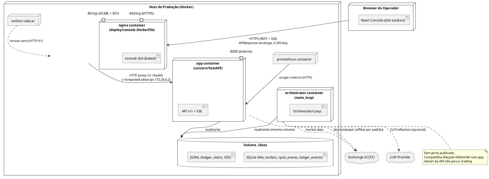

**Notas de design:**
- **Três topologias** no repo: `docker-compose.yml` (dev, todas as portas expostas + Prometheus/Grafana, perfis `scale` com Postgres/Redis), `docker-compose.prod.yml` (só nginx publica 80/443; app/loop/prometheus internos em rede `edge` 172.28.0.0/24) e `docker-compose.vps.yml` (sem portas de host, atrás de gateway `btv-nginx-prod` compartilhado).
- **Isolamento de rede em prod:** `app` confia apenas no nginx para `X-Forwarded-*` (rate-limit por IP real). `APP_ENV=production` força `API_KEYS` + `CORS_ORIGINS` explícito (fail-closed no boot).
- **Escala horizontal (ADR-005):** trocar SQLite→Postgres e in-memory rate limiter→Redis é opt-in via env, sem mudança de código (graças à abstração `db.connection` e `build_rate_limiter`). **Ressalva:** o loop é *single-instance* — o modelo de HITL por polling de SQLite não é trivialmente replicável para N loops.

---

## 9. Análise Crítica: Coesão, Acoplamento e Refatoramento

### 9.1 Pontos fortes
- **Fluxo de trading coeso e auditável:** o pipeline `Strategy→Risk→HITL→Execution` é linear, testado e totalmente registrado no ledger/XES. Fail-safe em todas as fronteiras (dry-run, LLM opcional, fail-closed no HITL, circuit breaker).
- **Separação de processos correta:** API e loop desacoplados por lifecycle, comunicando via estado compartilhado — resiliente a restart.
- **Contrato tipado ponta-a-ponta:** `openapi.d.ts` + drift-gate no CI eliminam divergência backend↔frontend. Exemplar.
- **Infra portável:** abstração de DB (SQLite↔Postgres) e rate limiter (memória↔Redis) por configuração.
- **Padrões bem aplicados:** Strategy (estratégias), Repository (ledger/order/journal/alert stores), Event Sourcing leve (ledger→métricas derivadas), Registry/Factory (`STRATEGY_REGISTRY`, `MCPToolRegistry`), Observer/PubSub (`AlertBus`→SSE), Template Method (`BaseAgent`).

### 9.2 Pontos de atenção (dívida técnica / refatoramento)

| # | Achado | Impacto | Recomendação |
|---|---|---|---|
| 1 | **Duas fundações de agente** (`BaseAgent` async vs `SafeAgentBase` sync) sem ponte | Confusão conceitual; `SafeAgentBase` não usado no trading | Decidir uma base única ou documentar claramente os dois propósitos |
| 2 | **Cluster "BuildToValue" paralelo** (`UnifiedOrchestrator` + planning/routing/consensus/chains/parallel + agentes de engenharia) não exercitado pelo trading | Código potencialmente morto; ~⅓ dos módulos de orquestração | Isolar em pacote opcional ou remover; medir cobertura real |
| 3 | **Colisões de nome:** `SquadOrchestrator`×2, `AdaptivePlanner`×2, `ContinuousEvaluator`×2, `MemoryStore`×2, `Guardrail`×2 | Erros de import, ambiguidade em revisões | 🟢 **Feito (Onda 2, R2):** renomeadas → `A2ASquad`, `AdaptiveReplanner`, `AgentPerformanceEvaluator`, `RelevanceMemoryStore` (resta `Guardrail`×2) |
| 4 | **Duas políticas de validação de ordem** (`GuardrailSystem` vs `SecurityConfig.validate_order`) e **dois modelos de autonomia** (US$ threshold vs trust-score) | Regra de negócio duplicada; risco de divergência | Eleger fonte única de política de risco/autonomia |
| 5 | **Sizing por `position_size_pct` fixo** enquanto `KellyCriterion`/`PositionSizer`/`CapitalProtections` existem prontos | Subaproveitamento de gestão de risco | 🟡 **Parcial (Onda 2, ADR-006):** Kelly virou fonte única no endpoint; **resta** plugar no `SquadOrchestrator._position_quantity` |
| 6 | **Namespace `/v1/agents/...` servido por dois routers** (`agents` e `config`) | Manutenção confusa; risco de conflito de rota | Consolidar num único router |
| 7 | **HITL por polling de SQLite** acopla loop e API ao arquivo | Latência de até `poll_interval`; loop single-instance | Considerar `LISTEN/NOTIFY` (Postgres) ou fila se escalar |
| 8 | **Frontend "classic scripts" com globals `window.*`** | Frágil a ordem de carga/colisões conforme cresce | Migrar para ES modules + bundler quando justificar |

### 9.3 Métricas qualitativas de acoplamento
- **Núcleo estável correto:** `core` é dependência de quase tudo, mas depende de pouco (config/db) — *stable dependencies principle* respeitado.
- **Acoplamento aferente alto e saudável** em `TradingLedger` e `db.connection` (são seams intencionais).
- **Acoplamento eferente problemático** no `UnifiedOrchestrator` (compõe 9 subsistemas) — sintoma de God Object no cluster genérico, reforçando o achado #2.
- **Desacoplamento por callback** (`GuardrailSystem.alert_sink`, `state_db_provider`, `fill_callback`, `approval_handler`) é usado consistentemente — bom uso de inversão de dependência para evitar imports cíclicos.

---

## Apêndice — Rastreabilidade (entidade → arquivo)

| Entidade | Arquivo-fonte |
|---|---|
| `BaseAgent` | `src/agents/base_agent.py` |
| `StrategyAgent` / `RiskAgent` / `ExecutionAgent` | `src/agents/{strategy,risk,execution}_agent.py` |
| `AgentRegistry` / `AGENT_REGISTRY` | `src/agents/registry.py` |
| `SquadOrchestrator` / `CircuitBreaker` | `src/orchestration/squad_orchestrator.py` |
| `OrchestratorLoop` | `src/orchestration/orchestrator_loop.py` |
| `UnifiedOrchestrator` | `src/orchestration/unified_orchestrator.py` |
| `OrderStore` / `Order` / `OrderStatus` | `src/hitl/orders.py` |
| `HITLConfigStore` / `AutonomyLevel` | `src/hitl/config.py` |
| `GuardrailSystem` | `src/safety/guardrails.py` |
| `SecurityConfig` | `src/safety/security_config.py` |
| `SafeAgentBase` + guardrails | `src/core/safe_agent_base.py` |
| `TradingLedger` | `src/core/ledger.py` |
| `PortfolioMetricsCalculator` / `PortfolioMetrics` | `src/core/metrics.py` |
| `ExchangeClient` | `src/core/exchange_client.py` |
| `Alert` / `AlertStore` / `AlertBus` | `src/core/alerts.py` |
| `db.connection` / backends | `src/core/db.py` |
| `Settings` | `src/core/config.py` |
| `BaseStrategy` / `STRATEGY_REGISTRY` | `src/strategies/` |
| `TechnicalAnalyzer` / `TechnicalIndicators` | `src/analysis/indicators.py` |
| `BacktestEngine` / `WalkForwardValidator` / `MonteCarloSimulator` | `src/backtest/` |
| `KellyCriterion` / `PositionSizer` / `CapitalProtections` | `src/risk/` |
| API gateway + middleware | `src/api/main.py` |
| DTOs / contrato Pydantic | `src/api/schemas.py` |
| Rotas `/v1/*` | `src/api/routes/*.py` |
| Providers de dependência | `src/api/deps.py` |
| Dashboard | `src/dashboard/app.py` |
| Console React + `CT_API` | `docs/design/pages/*.jsx`, `apiClient.js` |
| **Contrato TS gerado** | `docs/design/pages/openapi.d.ts` |
| Topologias de deploy | `docker-compose*.yml`, `deploy/`, `Dockerfile` |

---

> **Documento gerado por análise estática recursiva de todo o repositório.** Diagramas em **Mermaid** (renderizam nativamente no GitHub) e **PlantUML** (casos de uso e implantação — requerem renderizador PlantUML). Nomes de classes/módulos preservados *case-sensitive* conforme o código-fonte.
